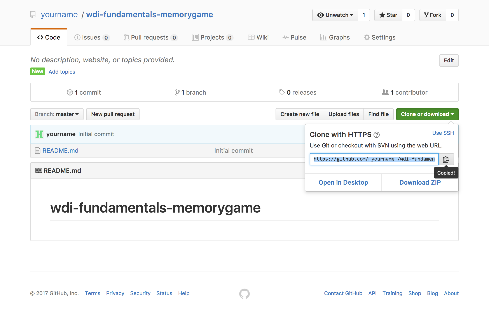

**WDI Fundamentals Unit 2**

---

# Developer Tools Assignment

Throughout the next few units, you're going to build a Memory Game! In order to share it publicly, and turn in the assignment, you'll need to set up your Github account. Follow the instructions below to get started!

## Exercise

#### Requirements

- Create a GitHub account
- Fork the WDI Fundamentals Memory Game repository
- Clone your fork locally

#### Below are the steps to complete the assignment.

1. If you don't already have a Github account, [create one](intro-to-github-exercise.md) on github.com.

2. Once you're logged into github.com, click the `+` in the top right of the menu bar, and select "New Repository".

3. Name your repository `wdi-fundamentals-memorygame` and remember to select the checkbox "Initiate this repository with a README."

4. After you create your new repository, you'll need to clone it to your computer. Referencing the image below, copy the URL you'll need to clone the repository. 

	

5. Next, open up the terminal application on your computer and navigate to the `fundamentals` directory within your home directory.
  
6. Once there, run the following Git command from command line:
 
`git clone https://your/clone/url` (substituting the clone URL you copied above)
 
  This will copy your forked repo from GitHub to your computer, so that you can work on it locally.

7. If you have followed these directions correctly, now, you should have a repository in your `fundamentals` folder called `wdi-fundamentals-memorygame`. Right now, the repository is just an empty directory– but cloning is an important skill to learn, and we'll be adding files soon.

---

[That's it for now! On to the next Unit.](../03_unit/intro-to-html-intro.md).
