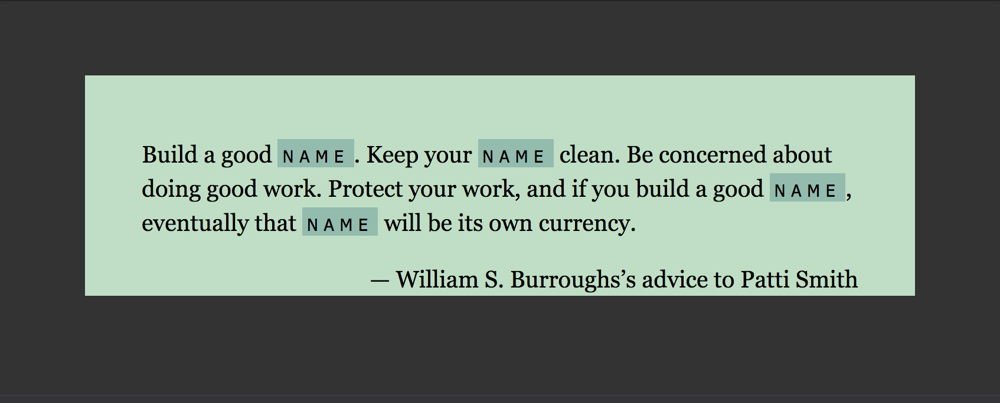

**WDI Fundamentals Unit 5**

---

## Your Turn

In this exercise we'll take some time to play around with `div`s, `span`s, `margin`, and `padding` to create a lovely text layout.

Here's what the content will look like when you're finished styling it. Fancy!

If you don't see the JS Bin below, please refresh the page.

We won't touch the HTML, but take a look at it before you hop over to the CSS tab. To give yourself more space you can select the CSS and Output tabs. Also, we gave you the `p` style. You're welcome!

<a class="jsbin-embed" href="http://jsbin.com/xidodiz/embed?html,css,output&height=600px">Box Model on jsbin.com</a>

0. Set the `background-color` of `body` to `#333` and the `background-color` of `div` to `#c0dec5`.

0. Add a `margin` of `64px` on *all four sides* of the `div`s content (outside the pale blue box).

0. Set the `div`s top `padding` to `32px`, a left and right `padding` of `48px`, and no `padding` on the bottom.

0. Create a rule for `span` and set these three property-value pairs: a `font-variant` of `small-caps`, a `font-family` of `Tahoma, sans-serif`, and a `letter-spacing` of `.25em`.

0. Set the `span`s `padding` to `0 3px`. Set its `background-color` to `rgb(100,150,150)`.

0. On second thought, that color is a little dark. Let's practice with RGB and alpha and make it 50% translucent. Change the `span`s `background-color` from `rgb` to `rgba` and add a `.5` alpha.

0. In your HTML, the second `p` tag has a class attribute named `source`. Let's right-align that paragraph! Add the new style to your CSS.

Fabulous! You just rocked on a bunch of topics that can stump even professional web designers.

> Stuck? Check out the [solutions](../exercise-solutions.md#the-box-model) for assistance.

---
[On to the next lesson.](header-footer-nav.md)
