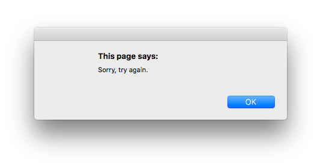

**WDI Fundamentals Unit 9**

---

# Unit 9 Assignment

In this unit, we looked at how we can use functions to group together statements that perform a specific task and reduce repetition in our programs. Now we'll apply these principles to our memory card game. 

This will help us to organize our code, avoid repetition, and make our game more versatile and maintainable.

Are you ready?

## Exercise

#### Requirements

For this unit's assignment, you will be adding functions to the code from the previous assignment to group together steps that perform specific tasks in our game. 

**First you'll create a function that will store all steps related to selecting, or flipping over, a card.** When the user flips a card over, you'll want to add that card to the array of cards that are in play. If the user has flipped over two cards, you'll want to check for a match.

**Second, you'll create a function to group together the logic to check to see if the two cards that the user has flipped over match each other.** You'll provide feedback to the user letting them know if the two cards match, or if they should try again.


#### Instructions

0. Open the `memory_game` folder in Sublime Text. You'll want to open the `index.html` and `main.js` files in this folder in Sublime.
0. In `main.js`, create a function to store all steps that should happen when the user flips a card. 
	- In your `main.js` file, after the lines with the `cards` and `cardsInPlay` arrays, create a function `flipCard`.
	- The function should accept one parameter: `cardId`.
	- Move all the code that you wrote for the last unit's assignment, **except** for the `cards` and `cardsInPlay` arrays into the `flipCard` function. 
	
	> Note: We are leaving the two arrays _outside_ of the `flipCard` function since we want to make sure that the two arrays have _global_ scope.

0. Next, we can clean up some of the code from the last exercise. We had some code that was repetitive that we can now optimize. Delete these lines of code that you wrote in the last exercise:

	```js
	var cardOne = cards[0];
	cardsInPlay.push(cardOne);
	console.log("User flipped " + cardOne);
	
	var cardTwo = cards[2];
	cardsInPlay.push(cardTwo);
	console.log("User flipped " + cardTwo);
	```

0. Within the `flipCard` function, add a `console.log()` statement to display the card that was flipped over. 
	- We'll use the index number that is passed in when the `flipCard` function is called to access this card from the `cards` array like so: `cards[cardId]`.
	- The message that is logged in the console should read `"User flipped queen"` or `"User flipped king"`.

		> Hint: Use string concatenation inside of the `console.log()` statement to construct this message.
		
		> `"User flipped " + cards[cardId]` 

0. Next, we'll want to add the card that the user flipped to the `cardsInPlay` array.
	- Use the push method to add the card that the user flipped (`cards[cardId]`) to the `cardsInPlay` array.

0. Now let's call the `flipCard` function to simulate the user flipping a card.
	- On the line _after_ the `flipCard` function, call the `flipCard` function, passing in `0` as an argument.
		
		> Note: we'll want to make sure to call the `flipCard` after it has already been defined, or we will get an error.
		 
	- Now, on the next line, call the `flipCard` function again, passing in `2` as an argument.
	- These numbers we are passing in as arguments represent the index numbers of the cards in the `cards` array that we want to flip over.
	- Save your `main.js` file, open the `index.html` file in Sublime, right click, and open the project in Chrome. Then navigate to the console and check to make sure that the `"User flipped queen"` and `"User flipped king"` messages are displayed.
  
0. Almost there! To add a little extra organization to our code, let's create a function to store the steps to check for a match. 
	- Right below the `cardsInPlay` array and right above the `flipCard` function, create a function `checkForMatch`. This function will not have any parameters.
	- Move the following lines of code into the `checkForMatch` function.
		
		```js
		if (cardsInPlay[0] === cardsInPlay[1]) {
			console.log("You found a match!");
		} else {
			console.log("Sorry, try again.");
		}
		```
	- Now, call the `checkForMatch` function from inside the `flipCard` function, where the lines above used to sit.
	- Save your `main.js` file, open the project in Chrome and open the console. Make sure that the `"User flipped queen"` and `"User flipped king"` messages are still displayed.

	> Note: We want to make sure that the `checkForMatch` function comes before the `flipCard` function, so that when we call the `checkForMatch` function from within the `flipCard` function we will not get an error.
	
Woohoo! Nice work! Now we've added some organization to our code and created a reusable function that can be called each time the user flips over a card. 

#### Deliverable




#### Pushing Code Up to the Repository

In order to back up your code and track your work, you'll want to commit the changes you've made to the project's repository. You'll have to open up the terminal and `cd` into the correct folder that holds the cloned repository for this assignment. Once you're there, complete these three steps:

0. Stage your code.

	`git add -A`

0. Create a version of your staged code.

	`git commit -m 'created game logic'`

0. Push your code to the GitHub repository.

	`git push origin master`


---
[Next up: Objects!](../10_unit/objects-intro.md)
