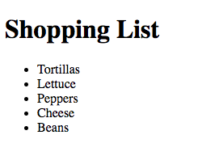
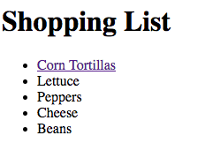
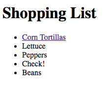
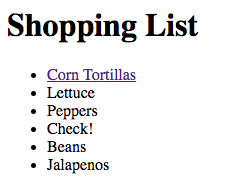
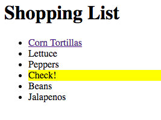

**WDI Fundamentals Unit 11**

---

# Manipulating the DOM

Now that we've done all that hard work finding elements, we can actually do something with them! Let's take a look at some more advanced methods that allow us to update content and styles.


## Updating Content

We'll be using this HTML page as a reference in the following examples:


```html
<!DOCTYPE html>
<html lang="en">
<head>
	<meta charset="UTF-8">
	<title>DOM Manipulation</title>
</head>
<body>

	<h1>Shopping List</h1>
	<ul>
	  <li>Tortillas</li>
	  <li>Lettuce</li>
	  <li>Peppers</li>
	  <li id="important">Cheese</li>
	  <li>Beans</li>
	</ul>
	
</body>
</html>
```

It will look like this when it is first loaded into the browser:




So how do you access and update content? Let's take a look at some of the properties and methods that allow us to read and update the contents of a DOM node.


#### Updating Content &mdash; `innerHTML`
Let's start with `innerHTML`.

We can use the `innerHTML` property to get and set content for an element.

For example, if we want to change the HTML content for the first `<li>`, we could execute the following:


```js
document.getElementsByTagName('li')[0].innerHTML = '<a href="http://allrecipes.com/recipe/17500/corn-tortillas/">Corn Tortillas</a>';
```

`innerHTML` would change the HTML content of the first `<li>` to `<a href="http://allrecipes.com/recipe/17500/corn-tortillas/">Corn Tortillas</a>`.



If we simply want to retrieve the HTML content to use later on, we can grab it and save it in a variable, like so:

```js
var firstListItem = document.getElementsByTagName('li')[0].innerHTML;
```


#### Updating Content &mdash;  `textContent`
Now, let's turn our attention to the concept of `textContent`.

This property allows us to get and set the text content for an element. For example:

```js
document.getElementById('important').textContent = 'Check!';
```

This code would change the text content of the `<li>` that has the ID `important` to 'Check!'.



#### Compare and Contrast: `textContent` vs. `innerHTML`

So how do innerHTML and textContent differ? When we are setting content with `textContent` any HTML will be displayed as text:

```js
document.querySelector('p').textContent = "Visit my <a href='http://www.example.com'>Site</a>";
```

Result:


In contrast, when setting content by updating the innerHTML property, any HTML tags will be inserted into the page as actual HTML content, not just text:

```js
document.querySelector('p').innerHTML = "Visit my <a href='http://www.example.com'>Site</a>";
```

Result:


## Adding Elements
To add new elements to the page, we'll need to use a three step process:

1.  We will use the `createElement()` method to create a new element, which can then be added to the page. When this node is created, it will be _empty_. This element will be stored in a variable.
2.  Next we will add content to the element using the `innerHTML` or `textContent` properties.
3.  Now that our element has been created, we can add it as a child of an element using the `appendChild()` method. This will add an element as the last child of the parent element.


To add a sixth item to our list we can execute the following code:

```js
// First up, let's create a new list
// item and store it in a variable.
var newListItem = document.createElement('li');

// Alright, now let's update the
// text content of that list item.
newListItem.textContent = 'Jalapenos';

// And finally, let's add that list
// item as a child of the ul.
document.getElementsByTagName('ul')[0].appendChild(newListItem);
```




## Getting & Setting Attributes
Let's talk some more about getting and setting attributes.

#### `className`
We can change the value of a class attribute for an element using the `className` property. This will apply the styles in our CSS associated with that particular class.

For example, maybe we want to highlight an important task on our list. We can add a class and styles in our CSS like so:

```css
.complete {
	background-color: yellow;
}
```

Then, we can use JavaScript to add this class:

```js
document.getElementById('important').className = 'complete';
```


After executing this JavaScript, the `.complete` class will be added to the element with the id `important` and the background-color associated with this class will be applied:



#### Getting & Setting Attributes &mdash; `setAttribute()` and `removeAttribute()`

We can _set_ and _remove_ attributes from elements using the `setAttribute()` and `removeAttribute()` methods.

For example, if we want to update the href attribute on an anchor, we could do the following:

```js
document.getElementsByTagName('a')[0].setAttribute('href', 'http://newurl.com');
```

Here 'href' is the name of the attribute we want to change, and 'http://newurl.com' is the new value for that attribute — a url.

Or, if we wanted to remove the id from an element, we could execute the update like so:

```js
document.getElementsByTagName('a')[0].removeAttribute('id');
```


## Conclusion

This is just the tip of the iceberg when it comes to DOM manipulation. 

There are so many methods and functions to keep track of in the beginning that it can seem a little overwhelming. But don't feel like you have to sit down and memorize everything right now. 

Instead, focus on understanding the big picture, and memorization will come with practice.


---


[Your turn!](manipulating-the-dom-exercise.md)
