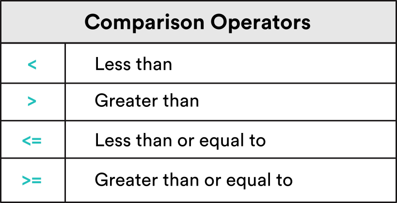
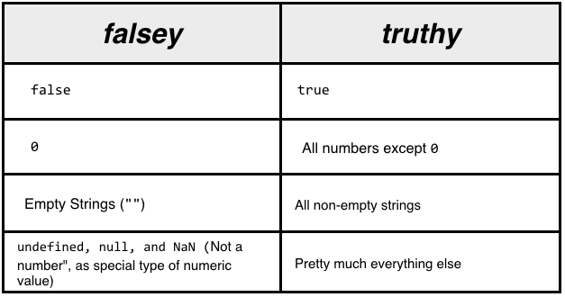

# Comparison and Logical Operators and Booleans

**WDI Fundamentals Unit 8**

## Comparison and Logical Operators and Booleans

### Comparison and Equality Operators

Comparison and logical operators are useful in JS because they help us compare different conditions to one another.

**Comparison Operators**

Comparison operators compare two values against one another and return a boolean value — either `true` or `false`.

Comparisons in JavaScript can be made using `<`, `>`, `<=`, and `>=`, and work for both strings and numbers.



**Equality Operators**

Now let's take a look at equality operators.

Equality operators check to see whether two values are the same as, or equal to, one another.

* **Equality** \(`===`\) : This operator will accept any two types of data as inputs and \(just like the comparison operators\) evaluate to a Boolean value. It will only evaluate `true` if both sides are completely identical in data type and value.  For example: `5 === 5` will evaluate to `true`, while `5 === '5'` will evaluate to `false` since, while the values are the same, `5` is a number and `'5'` is a string.
* **Inequality** \(`!==`\) : This operator will also accept any two types of data as inputs and evaluate to a Boolean value. It is essentially the reverse of the equality operator — it compares two values to check that either the data type or value are _not_ the same.  For example: `5 !== 5` will evaluate to `false`, while `5 !== '5'` will evaluate to `true`.

**Test Yourself**

Type each command given in the JS Bin Console below. Before you press enter, take a moment to think about what value the console will return.

You may need to refresh the page if you cannot see the JS Bin Console.

[JS Bin on jsbin.com](https://jsbin.com/qiqufo/1/embed?console)

1. `8 > 8`
2. `8 >= 8`
3. `8 < 8`
4. `8 < 13`
5. `8 <= 15`
6. `7 === 7`
7. `7 === "7"`
8. `7 !== 7`
9. `7 !== "7"`
10. `6 === 7`
11. `6 !== 7` 

### Null and Undefined

At this point, we've covered most of what you need to know about basic expressions. However, there are a few quirks and exceptions that we've \(until now\) glossed over, especially related to Boolean logic. Let's take a closer look at a few.

#### Undefined

Say you've just opened a JavaScript console. You want to define a new variable but aren't sure what the value is _just yet_.

```javascript
var someData;
```

Without **assigning** a value to a variable, that variable becomes `undefined`. We can see this in real time:

```javascript
var someData;
console.log(someData);
// => 'undefined'
```

One way to check to see if a variable is `undefined` is to use `typeof`. This method is possible because `undefined` is a specific object and its own data type.

```javascript
// we need a new variable...
var anotherData;

typeof anotherData;
// => "undefined"
```

For extra context, learn more about `undefined` from [Mozilla's MDN entry for "undefined."](https://developer.mozilla.org/en-US/docs/Web/JavaScript/Reference/Global_Objects/undefined)

#### Null

`null` values are values that you decide have **no value**. Why would I want to do this? Why not use `undefined`?

Convention is that `undefined` is reserved for variables whose values haven't been set yet. `null` is reserved for variables whose value is explicitly nothing — instead of just "not defined yet."

`null` gives us a way to "reset" the value of a variable to "nothing."

Here's an example:

Suppose you have an application for keeping track of your possessions. You might have a string called `locationOfKeys` indicating where you can find your keys.

Then, one day, your keys get lost. What's the value of `locationOfKeys` now? Well, it's "nothing" — they are lost.

If `null` didn't exist, we would have to invent a special string value \(perhaps `"lost"`\) to signify that the keys are missing.

`null` gives us a standard way of handling that kind of situation in which we can simply say `locationOfKeys = null;`

That's the purpose of `null`. It is designed to represent the _lack of a value_.

Whenever variables are defined without any value, they are `undefined`. This can become tricky to troubleshoot over time, as it acts as a catchall for _everything without a value_.

We can **specify** our variables as `null` to represent that there is no data.

```javascript
// we will define a variable with no value, or null.
var playerScore = null;
```

We can then **evaluate** if our value is `null`:

```javascript
playerScore === null // The player has not scored anything
```

What if we are provided with an input representing a player's actions in a timed game? In _Dance, Dance, Revolution_, a player must perform an action at a precise interval. It streams a set of commands a player must _dance_ to. These are timed to music. The actions stream across the screen, and, as they pass by the middle of the screen, the player _must_ perform an action in order to score a point. The game can evaluate the player's score in real time!

```javascript
var userInput = null;
userInput === null // No points... this time
```

### Boolean Logic

Everything in JavaScript — from the strings we learned about in Unit 1 to the `null` and `undefined` values we just covered — has an inherent Boolean value that can be thought of as being either _truthy_ or _falsey_.

But what does it mean to say that, for example, `"apple"` is _truthy_?

`"apple"` is not literally `true`, but the javascript language considers it to be _truthy_.

We can prove this by "double negating" a value in javascript, to force \(or "coerce"\) it into its boolean value.

To do this, we will use a new operator - the NOT operator.

* NOT\(`!`\): If the value is truthy, return `false`; if the value is falsey, return `true`.

A handy little trick is that we can put `!!` before any value to check to see if it is _truthy_ or _falsey_.

Take a look at the code below:

```javascript
true //=> true
!true //=> false
!!true //=> true
// Therefore true is truthy!

"apple" //=> "apple"
!"apple" //=> false
!!"apple" //=> true
// therefore "apple" is truthy!
```

**Falsey**

Something is _falsey_ when it can be coerced into the Boolean value `false`. The _falsey_ category of values includes:

* `false`
* `0` \(zero\)
* `""` \(empty string\)
* `null`
* `undefined`
* `NaN` \(a special Number value meaning "Not a Number"!\)

**Truthy**

Everything else in JavaScript is _truthy_.

Something is _truthy_ when it can be coerced into the Boolean value `true`. In JavaScript, _truthy_ values include:

* `"abc"` \(any non-empty string\)
* `-1`, `1`, `2.5` \(any non-zero number\)
* `true`

**Summary**

Below are the exact rules Boolean operators follow when dealing with non-Boolean input values.



**Test Yourself**

Type each command given in the JS Bin Console below. Before you press enter, take a moment to think about what value the console will return.

You may need to refresh the page if you cannot see the JS Bin Console.

[JS Bin on jsbin.com](https://jsbin.com/qiqufo/1/embed?console)

1. `"orange"`
2. `!!"orange"`
3. `7`
4. `!!7`
5. `false`
6. `!!false`
7. `true`

#### The Logical Operators AND and OR

In addition to NOT, the logical operators OR \(`||`\), and AND \(`&&`\) give us the ability to control the flow of our programs. But first we have to understand some of their odd quirks.


The boolean operators `!`, `||`, and `&&` follow a set of rules that determine how they behave:

* NOT\(`!`\): If the value is _truthy_, return `false`; if the value is _falsey_, return `true`.
* OR \(`||`\): Return the first _truthy_ value; if both values are _falsey_, return the last _falsey_ value. OR is nicknamed the "default operator" \(can you explain why?\)
* AND `(&&):` Return the first _falsey_ value; if both values are _truthy_, return the last _truthy_ value. AND is nicknamed the "guard operator" \(can you explain why?\)

**AND**

Let's take a closer look at the "truth table" produced by investigating all possible comparisons of `true` and `false` using AND:

```javascript
true && true //=> true
true && false //=> false
false && true //=> false
false && false //=> false
```

> Question: In the above table, what is the only case in which AND evalutes to `true`?

**OR**

Now let's do the same for all possible combinations of `true` and `false` using OR:

```javascript
true || true //=> true
true || false //=> true
false || true //=> true
false || false //=> false
```

> Question: In the above table, what is the only case in which OR evalutes to `false`? How does this compare to the behavior of AND \(above\)?

**Beyond true and false**

If you think you have a handle on AND and OR, think again. When we move beyond boolean values, things start to get a little strange:

```javascript
1 && 1 //=> 1
1 && 0 //=> 0
0 && 1 //=> 0
0 && 0 //=> 0
```

Is that what you expected?

```javascript
1 || 1 //=> 1
1 || 0 //=> 1
0 || 1 //=> 1
0 || 0 //=> 0
```

What's actually happening under the hood? \(HINT: think _truthy_!\)

**AND - The "Guard Operator"**

```javascript
true && "potato" //=> "potato"
true && true && true && "potato" //=> "potato"
```

What's the "guard operator" guarding? When does AND let you through? When does it stop you?

**Test Yourself**

Type each command given in the JS Bin Console below. Before you press enter, take a moment to think about what value the console will return.

You may need to refresh the page if you cannot see the JS Bin Console.

[JS Bin on jsbin.com](https://jsbin.com/qiqufo/1/embed?console)

```javascript
1 && "potato"
false && "potato"
0 && "potato"
```

**OR - The "Default operator"**

```javascript
false || "kiwi" //=> "kiwi"
false || false || false || "kiwi" //=> "kiwi"
```

What's the "default operator" defaulting to? When does it default?

Take a look at the following table, and see if you can predict the results in the last three columns given the values for A and B in each row.

| A | B | A AND B | A OR B | NOT A |
| :--- | :--- | :--- | :--- | :--- |
| `false` | `false` | `false` | `false` | `true` |
| `false` | `true` | `false` | `true` | `true` |
| `true` | `false` | `false` | `true` | `false` |
| `true` | `true` | `true` | `true` | `false` |

**Test Yourself**

Great! now type each command below into the JS Bin Console. Before you press enter, take a moment to think about what value the console will return.

You may need to refresh the page if you cannot see the JS Bin Console.

[JS Bin on jsbin.com](https://jsbin.com/qiqufo/1/embed?console)

```javascript
0 || "kiwi"
true || "kiwi"
1 || "kiwi"
1 || true
3 || null
!('')
false && undefined
true && !0
```

#### All Together Now: Combining Operators and Comparators

Often we need to combine individual logical statements into larger and larger expressions.

For example, all the following criteria need to be `true` before I will agree to purchase a vintage bicycle:

```text
make: Schwinn
model: Colegiate
year: 1975-1985
price (max): 125.25
```

We can translate each of these criterian into code using comparison operators as follows:

```javascript
make === "Schwinn"
model === "Colegiate"
year < 1985
year >= 1975
price <= 125.25
```

Next we can combine them together using our logical operators:

```javascript
make === "Schwinn" && model === "Colegiate" && year < 1985 && year >= 1975 && price <= 125.25
```

But what if I'd also settle for any make/model of bicycle, from any year, if the price was right \(which is to say, free\)? Is there a way I could incorporate that into my expression in a single line? There sure is!

Price is the most important factor, so let's address that first!

```javascript
price === 0 || make === "Schwinn" && model === "Colegiate" && year < 1985 && year >= 1975 && price <= 125.25
```

You can definitely squeeze it all into a single line of JavaScript... but we may need some better tools to handle all this complexity!

In the next lesson we'll take a look at how we can do just that using conditionals.

[Here's another exercise for you](logical-operators-booleans-exercise.md) — give it a shot.

