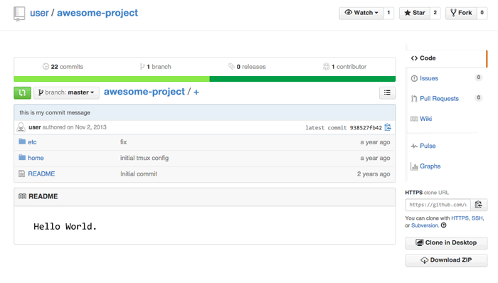
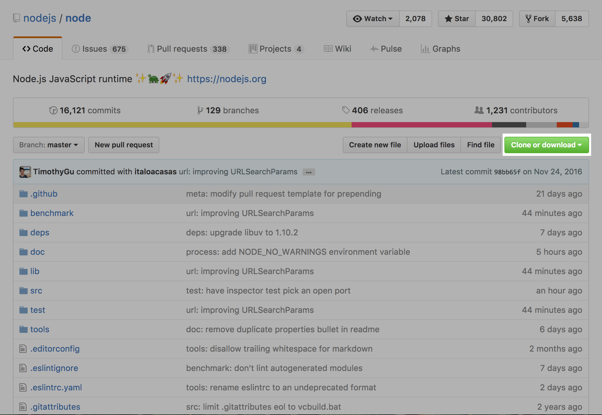

# Intro to Github

## Intro to GitHub

So far, we've been making changes "locally," editing files and repositories on our computers.

To collaborate with others \(and also back up our files just in case our computer goes out of commission\), we need to connect our local repository to a "remote" repository.

#### What is GitHub?

GitHub is a company, famous for the platform it built to manage Git repositories in the cloud. On GitHub, developers can share their code, comment on it, and review code changes among one another. It's an implementation of the same Git software you installed on your computer, but it also comes with some additional features.

In a lot of ways, GitHub is like Dropbox.

You have a folder in the cloud, your _remote repo_, which syncs with your computer. You can share this remote repo with others, grant them special permissions, and view different versions of your files.

Below is what the GitHub interface looks like for a repo called `awesome-project`:

1. **Repo Name and Owner**: describe who owns the repository, the name of the repo, and whether the repo is public or private.


2. **Overview**: displays the number of commits, branches, releases, and contributors to a particular repo. Selecting any one of these options will open a detailed view of your selection.



3. **Repo File Structure**: displays the contents of the repo. Selecting any file or folder will open a detailed view of that file and allow you to edit its content directly.


4. **Fork button**: allows you to copy a version of this repo \(`user/awesome-project`\) to your own GitHub account.


5. **Side Bar**: allows you to respond to issues, create pull requests, and change the settings for this repo.


There are many unique GitHub features crammed on this page, but we'll only be using three of them to start.

### Our GitHub Flow

There are a few different ways to work together on GitHub, and our class is going to use a specific order of operations to do so.

The GA Instructional Team has put together some resources for you in a repository on GitHub. You'll need to retrieve these files and save a copy on your computer using Git.

Eventually, when you've made changes that you'd like to share with our team, you can submit them back to us via our GitHub repo.

Our workflow looks like this:    
  


This workflow consists of the following steps:

1. Forking
2. Cloning
3. Editing
4. Adding/Committing
5. Pushing
6. Submitting a pull request

**Don't worry**, we are going to cover this step by step in plenty of detail.

#### 1. Forking

Let's walk through an example. Consider a project like NodeJS, a JavaScript framework. NodeJS is completely open source, which means that anyone can read \(and even copy\) the code that makes it work - including you! The source code is publicly available [here](https://github.com/nodejs/node) on GitHub; if you visit the main repo, you'll see that there are more than 1,000 contributors who have made committed changes to NodeJS.

Although it is open source and anyone can read or contribute to its code, NodeJS is **maintained** by a company called Joyent. Not all of these contributors have the ability to edit the original Joyent repo – that wouldn't be very efficient or safe. Someone could accidentally make a change that conflicts with someone else's contributions, causing the code to break. Changes need to be inspected and approved before they can officially be added to the project.

To create a copy of Joyent's repo, you would need to **fork** it by clicking "Fork" in the upper right-hander corner: 


> **Note** You don't follow these steps just yet. Read this chapter, and then you'll have a chance to try it out yourself in the [Unit 2 Assignment](../developer-tools-assignment.md).

"Forking" adds a copy of someone else's GitHub repo to _your_ GitHub account.

The forked repo is not perfectly identical, but it includes all the same source files, issues, and commit history.

By forking Joyent's repo, you could have a full working copy of the Node.js source code to play with. When you break something, which you will \(everyone does\), Node.js won't be affected.

#### 2. Cloning

Next, you'll want to be able to edit the code.

To make a local copy of a fork, you'll need to open up the terminal and use a Git command.

You need to navigate to the place where you'd like to store the repo, and then type:

```text
git clone https://url-to-clone
```

You can find the URL to clone by clicking the green button that says "Clone or Download": 

By issuing the clone command, you're asking GitHub via the command line for a copy of your remote repo, and this copy, or **clone**, ends up in your working directory.

> **HINT** If you're following along in Git Bash in Windows, the commands to copy and paste are a little different than the default Windows copy/paste commands. The command to copy is `control + insert`, and the command to paste is `shift + insert`.

#### 3 & 4. Editing, Adding and Committing

We covered this in the previous section. As you complete the exercises in the rest of Fundamentals, you'll need to repeat this step frequently.

#### 5. Pushing

Once you've committed the changes you've made to the code, your local repo will be different from your remote repo. To update your remote repo on GitHub, you have to **push** those changes using the Git command `git push origin master`.

Don't worry about the `origin` and `master` part just yet.

If you're curious, here's a brief overview:

* `origin` is a shortcut for the URL of your default remote repo \(in this case, the repo on GitHub\). You can have many remotes if you want, but we're only going to work with one in Fundamentals.
* `master` refers to the **branch** on your remote repo where you are currently adding your changes. Again, for now, we're just going to be working on the `master` branch.

#### 6. Submitting a Pull Request

Once your changes are pushed to your remote repository on GitHub, you can notify the original repo owner of your changes by submitting a **pull request**.

A pull request is effectively saying "Hello, maintainer of project X, I made some changes here in my forked copy, and I think they're pretty good. You should add them to your repository." Pull requests are a GitHub feature, so you'll need to head back to the browser to make this happen.

### Confused?

If you ever get stuck working with Git or GitHub, don't worry, you are NOT the first. When you don't understand something, we encourage you to search for an answer via Google or [Stack Overflow](http://stackoverflow.com).

Trust us – you _will_ get to the point where cloning and pushing are like breathing and sleeping.

[Ready try it out on your own?](intro-to-github-exercise.md)

