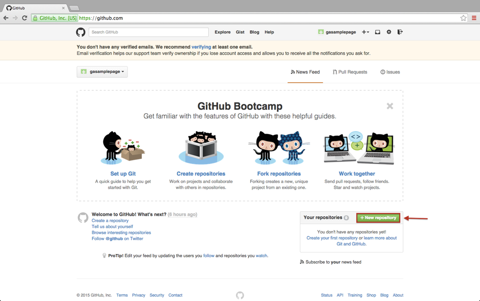

# Exercise

**WDI Fundamentals Unit 2**

##  Your Turn

GitHub enables you to host and share website files online, similar to the way Dropbox or Google Drive let you store and share other types of files. GitHub hosts the files in a remote server in the cloud and gives you a working URL so that you can share your finished site with other people.

Let's walk through this process:

### Create a GitHub account

**Step 1**: To start, let's head over to GitHub.com. The first thing we'll do is create a username by clicking on the field at the top right of the screen.

The username you enter here will be part of the github URL for every site you host there, so choose something simple and easy to remember. Most people use their name, a pen name, or their company's name. To simplify things, try making your username one word and all lowercase.

For this guide, we're going to use the name "gasamplepage." Please pick whatever name you like, for example "johnsmith123." After selecting our username, we'll add our email and make up a password. Then we'll click "Sign up for GitHub."

**Step 2**: Clicking that button brings us to the following page.

All we need to do on this page is make sure that "Free" is chosen as our personal plan. It should be pre-selected; however, if it's not, make sure to click on it. Then, press the "Finish sign up" button.

**Step 3**: GitHub will send you an email asking you to verify your account. Take a moment to do this now. If you do not verify your email address, your page will not work. When you log in, you should see the following dashboard.

Congratulations! You're officially a GitHub user!

[Great work! Now test your knowledge.](../developer-tools-quiz-b.md)

