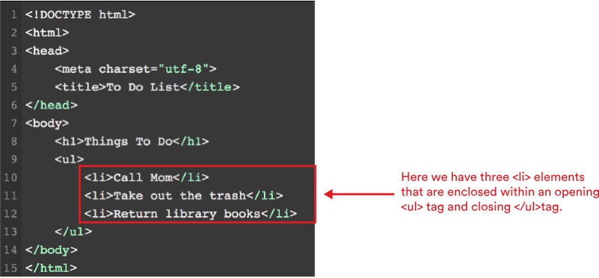
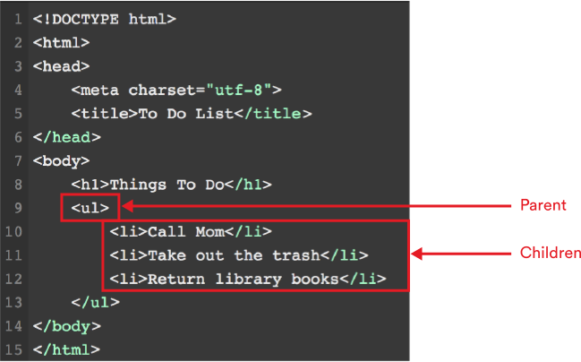
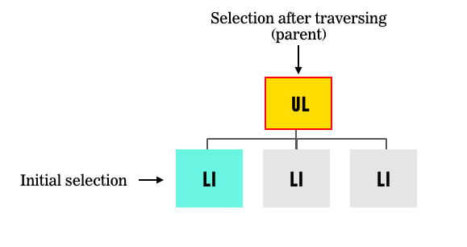

# Accessing the DOM

**WDI Fundamentals Unit 11**

## Accessing the DOM

Before we can update a page, we need to find, or select, the element\(s\) that we want to update.


### Objects Review

Before we dig in, let's briefly review _properties_ and _methods_.

Each element in the HTML document \(including the document itself\) is represented by a DOM node.

Each one of these nodes is an _object_ that has built-in properties and methods that can be used to access and update that node.

You'll recall that **properties** are characteristics associated with an object. In other words, properties tell us about an object.

We can _get_ and _set_ object properties using dot notation:

```javascript
// Here's how we would get the color property:
myBicycle.color

// Here's how we would set the color property for the myBicycle object
myBicycle.color = "blue";
```

**Methods** are the actions that can be performed on objects.

```javascript
myBicycle.accelerate();
```

Here, we use the object name `myBicycle`, followed by a period, followed by the method name, _followed by parenthesis_.

### Accessing Elements

Now let's learn about how we can find, or access, elements.

In order to find an element, we need to search through the document. The syntax for the search looks something like this:

```javascript
document.getElementById('main-nav')
```

Let's break this syntax down.

1. `document` — Refers to the document object. Any time we want to find an element, we'll need to access it through the document object. This will allow us to search throughout the entire page.
2. `.` The dot ties the method on the right-hand side \(`getElementById`\) with the object on the left-hand side \(`document`\).
3. `getElementById()` — Is the method we want to use to find an element. This particular method allows us to locate an element by the value of its `id` attribute. We'll take a look at the other methods available to us later in the lesson.
4. `'main'` — Just like with the functions we learned about earlier in this unit, we can pass in arguments for these methods to use. In this case, we want to find an element that has an `id` of `main-nav`.

> Important Note: As with all methods, using proper syntax here is important. These methods are case sensitive.
>
> Typing in `document.getElementByID` with a capital D will _not_ work and throws an error.

### Selecting an Individual Element

Now, let's explore how to select an individual element.

There are two methods we can use: `getElementById()` and `querySelector()`

Here's a closer look at both.


#### Selecting an Individual Element with `getElementById()`

The fastest route to finding any single element is `getElementById()`.

As you know from HTML and CSS, IDs are like labels we attach to elements in our HTML file by adding an `id` attribute to a specific element.

We can use IDs to select, or target, an element that we want to update. Because only one element on a page can have that specific ID, JavaScript's `getElementById()` query allows us to quickly find this individual element.

First, we will add an `id` attribute to the element that we want to update. In this case, we've added the `id` `about` to the div that wraps, or contains, the about content.

```markup
<!-- HTML -->
<div id="about">...</div>
```

We can then use JavaScript to search through the document object and find the element with an `id` of `about`.

```javascript
var sidebar = document.getElementById('about');
```

**Caching the Selection**

Here, we are storing the results of the `document.getElementById('sidebar')` query in the variable `sidebar`.

If we'd like to work with that element multiple times, a variable should be used to store, or **cache**, the results of our query. One of the benefits of caching is peformance. By saving the result of the query to a variable, you don't have to execute the query multiple times \(which can be costly for complex queries or large web pages\).

When we store an element in a variable, we are storing a reference to the location of that element in the DOM tree.

We can then use any methods we would normally use on an element on that variable.

#### Test Yourself

Take a look at the following HTML:

```markup
<ul>
    <li id="special">Feed the cat</li>
    <li>Take out the trash</li>
    <li>Mow the lawn</li>
</ul>
```

How could we use the `getElementById` method to select the list item with an id of `special`?

> \( Answer: `document.getElementById('special')`\)

#### Selecting an Individual Element with `querySelector()`

Great! Now that you've got that under your belt, let's talk about using `querySelector()`.

`querySelector()` is a method that allows us to use our CSS selector syntax to find an element.

If there are multiple elements on a page that match the selector, it will return the first of those matching elements.

Similar to `getElementById()`, we are only selecting one element.

> It is important to note that this is a recent addition to the DOM and is not supported by older browsers.

`document.querySelector('.special')`

This code will return the _first_ element on the page with `class` of `special`. You can use any of your CSS-style selectors as a parameter.

**Other Examples**

Let's look at a few other examples.

```javascript
document.querySelector('#sidebar')
```

This will return the _first_ element that has an id of `sidebar`.

> **Note** Note — remember, ids should be unique. However, if someone has coded the page and erroneously added duplicate ids, `querySelector` will only return the first.

```javascript
document.querySelector('ul li')
```

This will return the _first_ `<li>` that is a descendant of the `<ul>`.

#### Test Yourself

Take a look at the following HTML:

```markup
<ul>
    <li id="special">Feed the cat</li>
    <li class="complete">Take out the trash</li>
    <li>Mow the lawn</li>
</ul>
```

How could we use the `querySelector` method to select the element that has the class `complete`?

> \( Answer: `document.querySelector('.complete')`\)

### Selecting Multiple Elements

So far, the methods we've used to search through the `document` object have only been returning a single element.

But sometimes we'll want to find and work with several elements at once.

There are several methods we can use to return a **NodeList**, or _list of node objects_, to manipulate.

Let's take a look at some of the methods we can use to search through the document and find multiple elements.


We'll be referencing this HTML snippet for each of our methods:

```markup
<h1>Tasks</h1>
<ul>
    <li class="complete">Feed the cat</li>
    <li>Mow the lawn</li>
    <li>Wash the dishes</li>
    <li class="complete">Take out the trash</li>
</ul>
```

#### Selecting Multiple Elements — `document.getElementsByClassName()`

First, let's focus on `document.getElementsByClassName()`. This method allows you to select all elements with a given class attribute.

```javascript
document.getElementsByClassName('complete')
```

This will return any elements that have the class `complete`. In our "Tasks" example, this will return a _NodeList_ containing the first and fourth list items, as they both have the class `complete`.

#### Selecting Multiple Elements — `document.getElementsByTagName()`

Let's keep it going with `document.getElementsByTagName()`

This method locates all elements that match a given tag name.

```javascript
document.getElementsByTagName('li')
```

Here, this query will return all `<li>` elements. In this case, the NodeList will contain all four `<li>`s.

#### Selecting Multiple Elements — `document.querySelectorAll()`

Now, let's try out `document.querySelectorAll()`

While this command may look similar to our `querySelector()` method, the `querySelectorAll()` method allows us to use our CSS selector syntax to select one or more elements.

```javascript
document.querySelectorAll('.complete')
```

This will return any elements with the class `complete`. In the example above, this will return a NodeList containing the first and fourth list items, as they both have the class `complete`.

#### Test Yourself

Spend a few minutes writing out the following on paper or whiteboarding:

```markup
<h1>Pizza Toppings</h1>
<ul>
    <li class="vegetarian">Green Peppers</li>
    <li class="vegetarian">Jalapenos</li>
    <li>Pepperoni</li>
    <li>Sausage</li>

</ul>
```

1. How could we use the `getElementsByClassName` method to select all elements with the class `vegetarian`?
2. How could we use the `getElementsByTagName` method to select all `<li>`s?
3. How could we use the `querySelectorAll` method to select all elements with a class `vegetarian`?

> \(Answers: 1. `document.getElementsByClassName('vegetarian')` 2. `document.getElementsByTagName('li')` 3. `document.querySelectorAll('. vegetarian')` \)

### NodeLists

Now that you've got that down, let's work more with `NodeLists`.

Any time there is the potential for a method to return more than one element, such as with `getElementsByClassName()`, `getElementsByTagName()`, and `querySelectorAll()`, a NodeList will be returned, even if only one element is found that matches that query.

These NodeLists are **collections** and are numbered similar to the arrays we explored in an earlier unit.

Once we get our collection, we can select a single node using array syntax \(a set of square brackets\).

For example, we saw that `document.getElementsByTagName('li')` returned four list items. The NodeList would look like this:

| Index | Element |
| :--- | :--- |
| 0 | `<li class="complete">Feed the cat</li>` |
| 1 | `<li>Mow the lawn</li>` |
| 2 | `<li>Wash the dishes</li>` |
| 3 | `<li class="complete">Take out the trash</li>` |

To locate the third item in our NodeList, `<li>Wash the dishes</li>`, we could use the following syntax:

```javascript
document.getElementsByTagName('li')[2]
```

These indexes are just like the indexes we used when we learned about arrays.

We can also use a loop to iterate through each element in the NodeList and change each item.

Let's look at an example:

```javascript
var listItems = document.getElementsByTagName('li');

for (var i = 0; i < listItems.length; i += 1) {
  listItems[i].className = 'due';
}
```

This would loop through the NodeList and change the class name for each item to `due`.

> We'll take a look at the `className` method in the next lesson. For now just note how we can update all elements in a selection by looping through the elements.

### Traversing the DOM

Once we've selected an individual element, we can then either make a change to this element or select another element based on its relationship to the first one.

You'll often hear this referred to as **traversing the DOM**.

In an HTML document, elements can be nested inside of other elements.



In programming, relationships between the document and elements are often described in the same terms one would use to describe a family tree.



JavaScript has properties we can use to find an element based on an initial selection criteria. For example, the `parentNode` property can be used to locate the parent of an initial selection:

```javascript
document.getElementsByTagName('li')[0].parentNode
```

This will return the parent of the first `<li>` element, which, in this case, is the `<ul>` element, as it wraps all the `<li>` elements.



Some other properties we can use include:

* `nextSibling` — Will find the next sibling of a selected element.

  > Note: A sibling is an element with the same parent. For example, calling `nextSibling` on the first `li` in the picture above will return the second `li`.

* `previousSibling` — Will find the previous sibling of a selected element.

  > Note: For example, calling `previousSibling` on the second `li` in the picture above will return the first `li`.

* `firstChild` — Will find the first child of a selected element.
* `lastChild` — Will find the last child of a selected element.

[Let's practice accessing the DOM!](accessing-the-dom-exercise.md)

