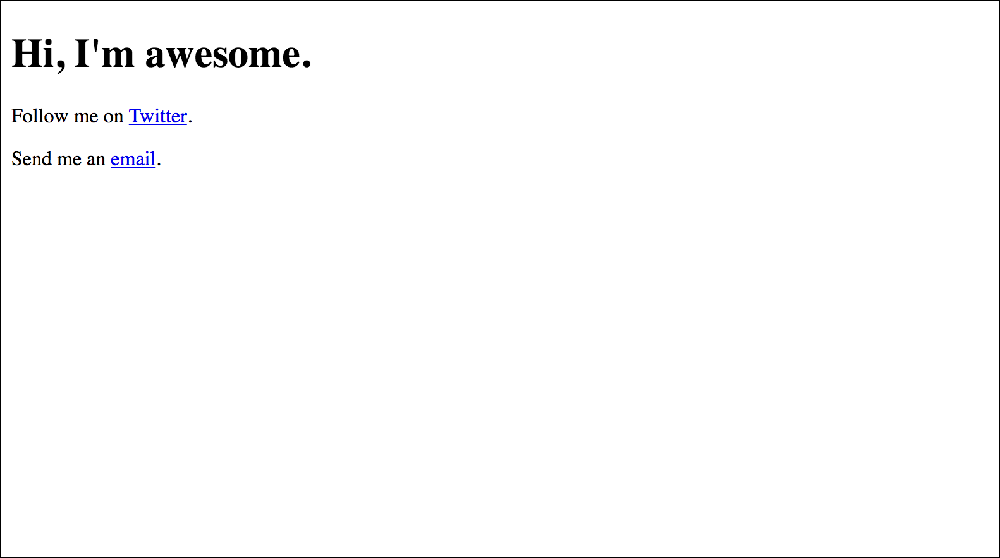

# Exercise

##  Your Turn

In this exercise, you'll write your first **hyperlinks**: Those magical, clickable links that get you from one place to another on the web.

When complete, your output should look like this:

### Instructions

Use the editor provided below to write your code and see what renders! If you don't see the JS Bin below, please refresh the page.

[I'm awesome! on jsbin.com](http://jsbin.com/juwaref/embed?html,output)

1\) Give your website some content: Introduce yourself, mention a social media account \(or a website of your choosing\), and invite users to send you an email. Try something like this:

_Hi, I'm awesome._   
_Follow me on Twitter.  
Send me an email._

2\) Wrap the first line, "Hi, I'm awesome." in `h1` tags.

3\) Wrap the rest of your content with `p` tags. You'll want to use paragraph tags on both the second and third line. HTML tags are reusable, so you can use as many of each kind as you need.

4\) Wrap the text, "Follow me" in an _anchor element_ \(`<a>` and `</a>`\).

5\) The opening `a` tag needs a _hyperlink reference attribute_ \(`href`\) so it knows where to go when clicked. Go ahead and link to your Twitter page \(or whichever website you chose\).

Example: `<a href="http://twitter.com/GA">Follow me</a> on twitter.`

> **NOTE** Sometimes you won't know which link destination you want until you've finished coding your site. In those cases, you can substitute a hash symbol as a placeholder, like so: `Send me an <a href="#">email</a>.`

6\) Now, wrap an empty `a` tag around the word "email" on the second line.

7\) Put `mailto`: in front of your email address so the browser knows it's not a web page.

Example: `Send me an <a href="mailto:me@email.com"> email </a>.`

> **NOTE** HTML pays attention to spaces between tags. Only words should be hyperlinked, not spaces or punctuation.

8\) And you're all done! Admire your rendered content in the **Output** window and review the Checkpoint below.

#### Checkpoint

Make sure you have:

* Made the introductory sentence a top-level heading with an opening `<h1>` tag and a closing `</h1>`tag.
* Wrapped the rest of the content in two sets of opening and closing `p` tags.
* Linked to your Twitter profile or another website.
* Created an email link with the proper email address or a placeholder.

> Stuck? Check out the [solutions](../../exercise-solutions.md#hyperlinks) for assistance.

[Your turn! Time to take the quiz.](../intro-to-html-quiz.md)

