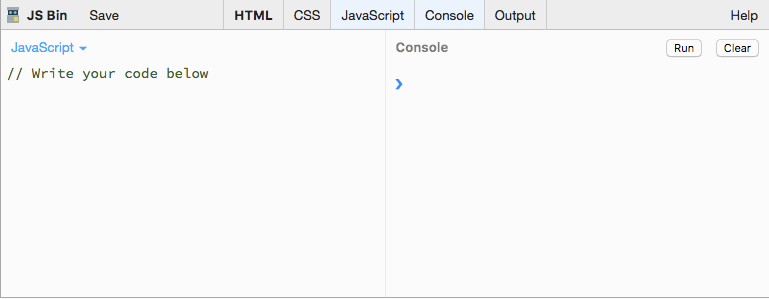
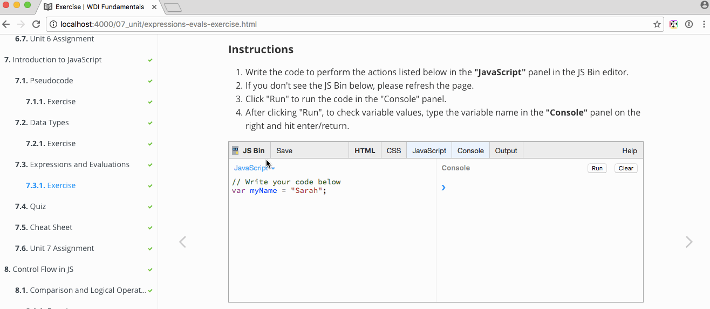

# Introduction to JavaScript

#### By the end of this unit, you'll be able to:

* Describe the purpose of whiteboarding and pseudo-code
* Implement whiteboarding and pseudo-code techniques 
* Declare, assign to, and manipulate data stored in a variable 
* Describe the concept of a data type and how it relates to variables 

## JavaScript

It's time for us to move on to the main event: programming. Now, we'll have the ability to add some functionality to our memory game!

### Programmatic Thinking

In this unit, you'll learn how to think like a programmer and troubleshoot different kinds of problems you may encounter. This kind of **programmatic thinking** will help you manage the technical skills you'll learn later in the course.

### What is Programming?

Programmatic thinking is the kind of critical thinking that helps you overcome problems you may face as a programmer. It allows you to solve issues efficiently, learn on your own, and problem solve on the fly.

Programming is like the difference between baking a cake from scratch and baking a cake from a box. When you bake a cake from a box, your cake will come out the same as the next person who purchases the same cake mix.

When you bake a cake from scratch, there are so many different types of cakes you could make, though it's probably more time consuming.

There is no right or wrong way to program, nor is there a right or wrong way to bake a cake.

Do you want your program to work efficiently \(or your cake to be baked with fewer ingredients\)? Or do you want a more complex program \(or bake a fancy wedding cake\)?

Whatever your answer, thinking programmatically will help you.

### Thinking Like a Programmer

Whatever your approach, eventually you'll run into problems and issues that require programmatic thinking.

Let's take a look at four tips for thinking like a programmer.

1. Remember how to problem solve
   * Some of the problems you'll encounter as a programmer will have multiple solutions and require creative and critical thinking.
   * The path forward will not always be obvious, and sometimes you'll have to take a step back and analyze the problem before moving forward. Be flexible and learn from mistakes in the process too!
   * Try to break the problem into as many more easily solvable pieces as possible. Remember: solving a hard problem is hard! Start with an easy one, and work up to the hard problem.
2. Remember how to break down your code
   * A computer is only as smart and efficient as the programmer who writes its code. You have to know how to break big ideas down into small steps and prepare the computer to handle failures before they occur.
   * The smallest programming error can keep your computer from running correctly. That's why it's essential to develop strategies for identifying errors early on. They are also usually easy to fix, just hard to spot.
3. Remember what you are trying to do
   * You have to know what you are doing with the code you are writing before you write it.
   * Remember, programming is not just about creating perfect code, it's also about what you are trying to do with the program you are writing.
   * **Pseudocode**, which we will cover in the next lesson, is a great way to plan the big picture.
4. Don't be afraid to use resources
   * A big part of becoming a programmer is learning to be self-reliant, but it's also important to know where to get help when you need it.
   * No developer knows how to do everything.
   * The world of development is vast and can quickly feel overwhelming when you're a beginner. Focus on the immediate task at hand and the skills necessary to solve THAT problem. Learn as you go, and pretty soon new technologies won't feel daunting at all!

Throughout this unit, we'll be exploring some of the more common tools and concepts available to programmers.

Although we will be specifically looking at these concepts in the context of **JavaScript**, these tools \(or similar ones\) are present in nearly every modern programming language.

Having a strong understanding of the basics is essential and will translate to your future work, whether you end up programming in JavaScript, Ruby, Python, or any other language.

### JS Fiddle

To start playing around with JavaScript, we'll be using a website called [**JS Fiddle** ](http://jsbin.com/).

As you can see in the screenshot above, JS Fiddle features different window panes.

On the left is the _editor_, or "JavaScript" panel. This is where you will be writing your JavaScript code.

On the right is the "Console" panel. To execute the code in your editor, click the "Run" button here. This is where we will see the output of our script.

After writing your JavaScript into the "JavaScript" panel and clicking the "Run" button, you will be testing the values for different variables \(which we will be covering shortly\) by typing the variable name into the right panel, the "Console", and then hitting the enter/return key.

To save your JS Fiddle session, click "Login or Register" at the top, and log in with GitHub. When you select "File," followed by "New," you'll open a blank workspace.

The moment you begin writing code, JS Bin will generate a URL that you can bookmark and come back to at any time.

You can hide or display any panels \(HTML, CSS, JavaScript, or Console\) as needed by clicking on the tabs at the top of the editor.

Ready to begin? [Let's go](pseudocode/).

