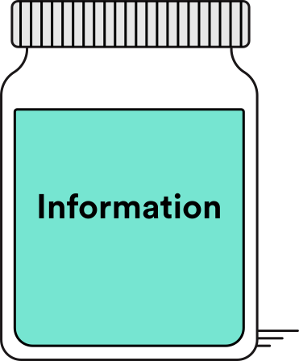
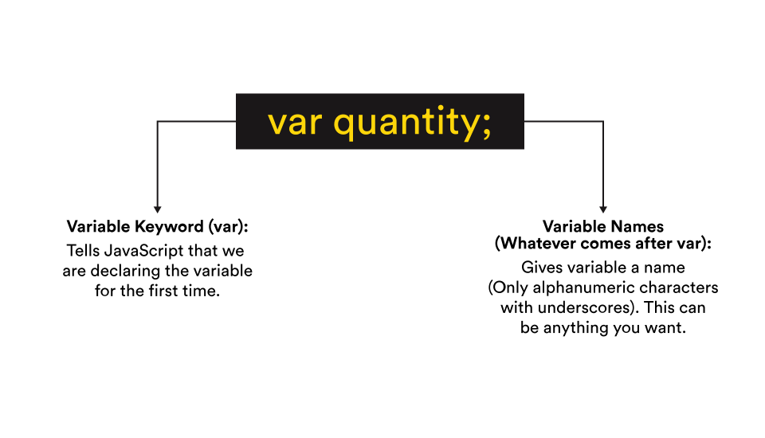
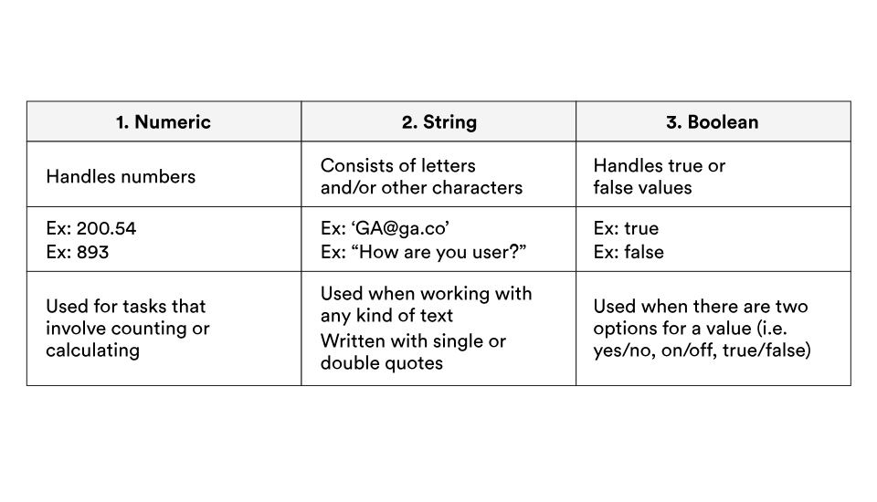

# Data Types

**WDI Fundamentals Unit 7**

## Data Types and Variables

### Intro to Variables

Variables are used to store data types into the memory of the computer so that they can be referenced later.

Think of them as special containers that can hold information for you.



In order to use a variable in JS, you must announce that you want to use it.

You make this announcement by using the keyword `var` and declaring a variable name next to it.



> Note: There must be a space after the keyword var.

Now that we've declared our variable names, we need to give them values.

If you declare a variable without assigning any value to it, its value is `undefined`.

```javascript
var name; 
// => undefined
```

So let's try assigning a value to variable:

```javascript
var name = 'Bill'; // the variable "name" gets assigned the string 'Bill'

name;
=> 'Bill' // the variable "name" now is the same as writing the string 'Bill'
```

Notice that the value is a word \(not a number\), so we put quotation marks around it.

We always put quotation marks around strings \(values that consists of letters and/or other characters\). We'll be talking about strings later in this lesson.

> Note: The `// =>` in the above example shows what the output will be when you type the line above it into the console and hit enter. For exercises and checkpoints, you will never have to actually type out any lines with `// =>` into the console.

**Variable Syntax**

Notice the space before and after the `=` sign and the semicolon after the string.

Making sure these are in place is a good habit to develop and will be important for when your code gets more complicated later on.

```javascript
var name = "Bill";
```

JS is a programming language, and like any language it has its own grammar and rules of operation. Let's look at four rules of thumb:

1. When creating/declaring a variable for the first time, use the `var` keyword.
2. Variable names should be written in camelCase
   * The first letter of the first word should be lowercase and the first letter of any subsequent words should be uppercase.
3. Add a space before and after the equal sign `=` .
4. Statements need to end with a semicolon `;`.

Note that in JavaScript, the equal sign doesn't evaluate things the way it does in math; rather, it _assigns values_ to things, like variables.

We call this an _assignment operator_.

**Reassigning Variables**

JavaScript runs synchronously and top-down, meaning it updates itself to the latest information given \(on the bottom\).

So the values we give our variables furthest down will overwrite any previous values given.

Let's take a look at a brief example. Say that we want to create variables for a character's name, age and location.

```javascript
var name = "Marty McFly";
var age = 16;
var location = "Hill Valley";
```

We can later replace, or reassign, the values of these variables like so:

```javascript
var name = "Marty McFly";
var age = 16;
var location = "Hill Valley";

name = "Doc Brown";
age = 65;
location = "Future Town";
```

Here's a brief video summarizing how to assign and reassign variables.

**Syntax Guidelines**

A good habit to help you avoid coding headaches: mind your syntax.

Here are some syntax rules that are crucial to keep in mind:

1. **JS is case sensitive**

   For example: `numberofstudents` is not the same as `numberOfStudents`, which is not the same as `NuMbErOfStUdEnTs`.

   When you want to use a variable name consisting of several words, you will get an error if you have spaces between the words. Instead, you can combine all the words together into one long variable name. The first letter in this variable name should be lowercase, and then the first letter in each word that follows should be uppercase. This is called camelcase \(see how it resembles a camel with humps\)?

   Here's another example: `var camelsAreAwesome = true;`

2. **End statements with a semicolon ;**

   `x = x + 1;`

   After each line of instruction, be sure to use a semicolon. Although you may be able to get away without using semicolons in some browsers, JavaScript often does nasty things when it guesses where to put semicolons itself. It's better to be explicit and tell the interpreter exactly where a statement should end.

#### Test Yourself

For the exercises in this lesson, you will be using the [JS Bin Console](https://jsbin.com/?console). Here are the steps to take for each exercise:

* Open the [JS Bin Console](https://jsbin.com/?console) in Chrome, or complete the exercise in the JS Bin widget on this page. You may need to refresh the page if you do not see the console below.
* Type your JavaScript into the console tab.
* Hit the enter/return key to run that line of code.
* You can click the "Clear" button to clear the console when you want a clean slate.

[JS Bin on jsbin.com](https://jsbin.com/qiqufo/1/embed?console)

**Step 1**

Create the following variables \(resist the urge to copy/paste, get practice typing these out!\):

```javascript
var name = 'Susan Smith';
var age = 20;
var hometown = "Hawaii";
```

You may see `undefined` displayed in the console after declaring each variable and hitting the return key:

```javascript
var name = 'Susan Smith';
// => undefined
```

Don't worry too much about why `undefined` is being displayed for now, but just be aware that this is the expected behavior.

> **HINT** You may have noticed that each of those lines ended in a `;` — in JavaScript, a semicolon is used to denote the end of a line. Although your code may execute without them, there may be cases where a missing semicolon could cause unexpected results. It's best to just get in the habit of using them.

**Step 2**

Now try checking, or accessing, the values of the three variables by typing each variable name and hitting enter:

```javascript
name;
age;
hometown;
```

**Step 3**

Then update \(reassign\) the value of each variable to your own first and last name, your own age, and your own location.

For example:

```javascript
name = 'Amy Hill';
age = 25;
hometown = "San Francisco";
```

**Step 4**

Now try checking, or accessing, the values of the three variables by typing each variable name and hitting enter:

```javascript
name;
age;
hometown;
```

**Summary**

We can redefine our variables `name`, `age`, and `hometown` as many times as we want. However, _**only the most recent value of each variable is retained**_ Once a variable is redefined, its original value is lost forever.

Consider the following JavaScript code:

```javascript
var x = 1;
x
// => 1
x = 2 + x;
// => 3
x;
// => 3
```

* On the first line, we are _assigning_ the variable `x`, setting it equal to the integer `1`. 
* Then, on the next line, we are _reassigning_ the variable `x`, setting it equal to the following: `2` plus the most recent value of x \(in this case, `1`\). 
* `x` would now be equal to the integer `3`.  

Suppose we ran the following lines of code in order, one by one.

```javascript
var x = 10;
x = 1;
x = 5;
x = 15;
x + 2;
```

What does that last line evaluate to? Or, put differently, what is the most recent value of `x` \(as of line 4\) + 2? If you guessed 17, you're correct! Is `x`'s value now 17? Not so fast! The last time a value was assigned to `x` was on line 4, so `x` is still 15. What if we had said `x = x + 2`?

### Data Types

We briefly mentioned earlier that you can add different types of values to JS variables. JS knows when you are using letters and when you are using numbers.

This will be handy later on when you start combining words or adding numbers together in your code. For now, it's important to know that these distinctions are called data types.

_In computer science and computer programming, a data type or simply 'type' is a classification identifying one of various types of data that determines the possible values for that type, the operations that can be done on values of that type, the meaning of the data, and the way values of that type can be stored._

Data types are really similar across different languages.

What this means is that being confident in working with these concepts critically will enable you to walk into any programming language with some base knowledge that is translatable.



We'll elaborate on all of these — except Booleans, for now.

**Numbers vs. Strings**

Notice that in JavaScript, you do not need to declare what type of data you are using.

For example, when you code:

```text
var a = 13;
var b = "thirteen";
```

JS will know that `var a` is a number and that var b is a string because strings always have quotation marks. Using quotation marks is a way of communicating with the processor what type of data to expect.

If you put quotations marks around a number, like so `"9"`, the processor will read it as a string. You should always be mindful of the type of data you use moving forward.

**typeof**

When we start writing more complex code, there may be times when we forget which type of data we're manipulating.

Luckily, the computer already knows which type of data we're working with, so we can use the `typeof` command in the console to find out.

`typeof` returns a string that tells us which type of data we're seeing.

Take a look at some examples:

```javascript
typeof 5;
// => "number"

typeof "John Doe";
// => "string"

typeof true;
// => "boolean"
```

Make sure to remember the `typeof` command in case you ever need to find out the type of data with which you are working.

**Test Yourself**

Add each line of code to the [JS Bin Console](https://jsbin.com/?console) and hit return to run that line of code.

Refresh the page if you don't see the JS Bin Console below.

[JS Bin on jsbin.com](https://jsbin.com/qiqufo/1/embed?console)

1. `typeof 'hello';`
   * The console returns 'string'.
2. `typeof 24;`
   * The console returns 'number'.
3. `typeof 3.45;`
   * The console returns 'number'.
4. `typeof true;`
   * The console returns 'boolean'.
5. `typeof "JS is fun!";`
   * The console returns 'string'.

### Strings and Numbers

**Strings**

Strings are collections of letters and symbols known as _characters_, and we use them to deal with words and text in JavaScript. They come in two varieties, 'single-quote' and "double-quote".

Although there are some differences between the two, don't worry about them for now. For the purposes of your work in Fundamentals, they will be interchangeable.

Strings are typically used to store text for people to read.

```javascript
'John'
"Jane"
'123'
```

**Numbers**

In JavaScript, numbers can always be divided into two groups:

**Integers \(whole numbers\)**

```text
..., -1,0, 2, 3, 4, 5, ...
```

**Floats \(decimals\)**

```text
2.718, 3.14, .5, .25, etc
```

This means that JS numbers can be positive, negative, or have a decimal point.

[Your turn!](data-types-exercise.md)

