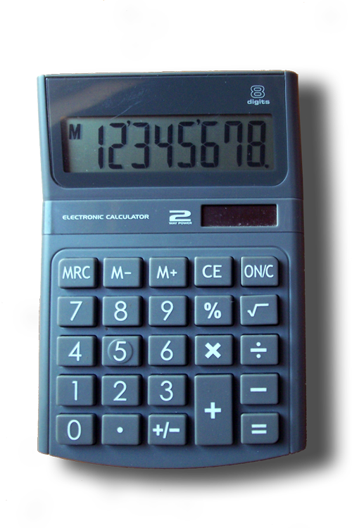
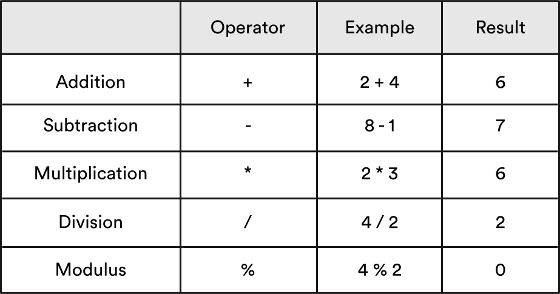
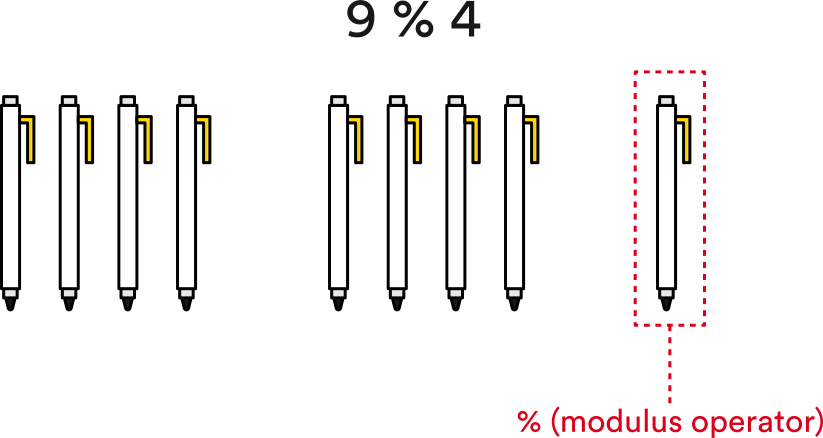
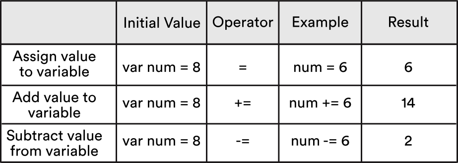

# Expressions and Evaluations

**WDI Fundamentals Unit 7**

## Expressions and Evaluations

In this section we'll be talking about expressions. What are expressions? Watch this [video](https://generalassembly.wistia.com/medias/e1c21pib0n) to find out.

Chances are, you've probably played around with a scientific calculator at some point in the past. You punch in a big number \(for example, 9876435\), then `x`, and then another big number \(say, 373848221\), and hit the `=` button. Then, the calculator spits back a result \(in this case, 3692287654572135\).



That information we type into the calculator is called an **expression**: a collection of values \(_12345_\) and operators \(like `+` or `x`\).

The process of reducing this expression down to a single value is called **evaluation**.

The JS Bin console you used for the exercises in the previous lesson is similar in many ways to a scientific calculator. It accepts an expression \(in JavaScript\) from its user and attempts to evaluate that expression, yielding a single value.

Before we tackle fully fledged JavaScript expressions, let's take a look at some operators we can use.

### Arithmetic Operators

How do we combine numbers and operators to come up with more complex expressions in JS?

It's simple — we use _arithmetic operators_.



All of the standard arithmetic operators learned in grade school \(addition, subtraction, division, and multiplication\) are supported in JS. These should look familiar.

But if you don't have a background in programming, that last operator — the modulus operator — might be new.

**Modulus**

The modulus operator shows the remainder of a division problem.

For example, 9 divided by 4 equals 2 with a remainder of 1. The modulus operator takes two numbers as inputs and returns what's leftover from the division.



The modulus operator `%` is particularly useful in programming if we want to find out if a number is even or odd.

If we divide by 2 and have a remainder of 1, we know the number is odd. If we have a remainder of 0, then we know that the number is even.

Let's look at some examples:

Odd numbers:

```javascript
5 % 2;
=> 1

7 % 2;
=> 1
```

Even numbers:

```javascript
4 % 2;
=> 0

2 % 2;
=> 0
```

This may seem tedious now, but it'll come in handy later on.

**Exercise:**

Look at the following five problems. Type each line of code into the [JS Bin Console](https://jsbin.com/?console) and see what is returned.

[JS Bin on jsbin.com](https://jsbin.com/qiqufo/1/embed?console)

1. `45 % 6;`
2. `10 - 20;`
3. `7 / 2;`
4. `3 * 2;`
5. `10 % 4;`

### String Concatentation and Coercion

Now, let's see how you can use string values \(textual information\) in JS.

When given string values, the `+` operator actually behaves differently — it concatenates, or combines, two strings together to make one big string.

Take a look in this brief [video](https://generalassembly.wistia.com/medias/rysrb53amn).

As you can see, putting single or double quotation marks around a value turns it into a string.

So, even though both "6" and "8" look like numbers to us humans, JS sees that they're in quotation marks and therefore treats them as strings.

```javascript
var number1 = "6";
var number2 = "8";

number1 + number2;
// => "68"
```

Using the `+` operator to put the two strings together literally puts them next to each other, instead of evaluating their total.

This is called concatenation \(when strings are glued together\).

Here's another example of concatenation.

JS glued the two strings together, but do you notice anything wrong?

```javascript
var firstName = "Han";
var lastName = "Solo";
firstName + lastName;
// => "HanSolo"
```

There is no space between the two words!

This is because we didn't add the spaces in ourselves. It's just one of many reasons why we have to carefully watch our spacing and grammar.

To fix this, we'll have to add in the space ourselves.

```javascript
var firstName = "Han";
var lastName = "Solo";
firstName + " " + lastName;
// => "Han Solo"
```

### Assignment Operators

Now, let's get back to some math and look at assignment operators.

You're already familiar with the `=` assignment operator, but there are also ones we can use to add or subtract value from a variable. Take a look:



The `+=` operator adds a value to an existing variable.

The `-=` operator subtracts a value from an existing variable.

> Note: Keep in mind that we'll always need an `=` somewhere in the line of code when we want to either assign or update the value of a variable, as in the above chart.

**Exercise:**

Type each of the following lines of code in the [JS Bin Console](https://jsbin.com/?console) and hit return to run each line of code.

[JS Bin on jsbin.com](https://jsbin.com/qiqufo/1/embed?console)

1. `var myNumber = 8;`
2. `myNumber += 3;`
3. `myNumber -= 5;`

What is the final value of `myNumber`? Type `myNumber;` into the console and hit return to check!

> Answer: The final value of `myNumber` should be `6`.

While we've covered what seems like a lot of math in this section, don't worry — you're not going to be doing calculus in this course. It's important that we review these concepts, because there will be many times when you'll solve a problem by using one of their basic principles. When it comes down to it, computers operate with a simple, straightforward logic.

**Working with Multiple Variables**

Sometimes, we find variables on both sides of the `=`. Suppose we have two variables, `x` and `y`, like the example below:

```javascript
var x = 5;
var y = 10;
x = y + 10;
```

What happens in that third line? For starters, everything to the right of the `=` must be evaluated before any kind of assignment can happen. This is why we like to use the phrase "assignment always happens right to left!" `y + 10;` evaluates to 20, so what we're left with is the expression `x = 20;`. This assigns the value 20 to `x`, and the entire expression evaluates to 20.

Let's look at one more example using the same two variables, `x` and `y`.

```javascript
var x = 1;
var y = 10;
x = y * 2;
y = x + 1;
x = y + 1;
y = 2 * x;
```

Feeling dizzy? Don't worry, we'll step through this one together.

**Line 1**: We declare a new variable `x` and assign it the value `1`.

**Line 2**: We declare another new variable `y` and assign it the value `10`.

**Line 3**: As of this point in the code, `y` has a value of `10`. We multiply that by 2, resulting in `20`. We assign that resulting value to `x`, so `x` now has a value of `20`.

**Line 4**: `y` then gets assigned a new value of `21` \(`20 + 1`\).

**Line 5**: `y` was just changed to 21, so `x` becomes 22 \(`21 + 1`\).

**Line 6**: `x` is now 22, so `y` becomes `2 * 22`, or 44.

One important thing to mention here is that **at no point is any lasting relationship established between x and y** \(unlike math equations\). We are simply evaluating the expression on the right and assigning the result to the variable on the left.

#### Test Yourself

Give these a try — see if you can predict the final values of `x`, `y`, and `z`.

Check your answers in JS Bin by copying the entire chunk of code into the editor window, running it, and then checking `x`,`y`, and `z` in the JS Bin console by typing out each variable name and hitting the return key.

If you don't see the JS Bin, please refresh the page.

[JS Bin on jsbin.com](https://jsbin.com/qiqufo/1/embed?console)

**Challenge \#1**

```javascript
var x = 1;
var y = 2;
var z = 3;
x = y;
y = z;
z = x;
```

**Challenge \#2**

```javascript
var x = 1;
var y = 0;
var z = -1;
x = y + z;
y = z * x;
z = x - y;
x = y * y;
y = z * z;
z = z - 1;
```

Whoa! That last one's pretty weird — how can `z` be on both sides of the `=`? What do you think happens there?

The key is remembering how the `=` operator works. Before it assigns anything to the variable on the left, _it first evaluates the expression on the right_. This means that, if we have any expression like `x = x + 1;`, what we are doing is taking the old value of `x`, adding 1 to it, and storing this new result back in `x`. In short, we are "incrementing" `x`: increasing its value by 1, no matter its original value.

Think you've got it? [Let's cement what we've learned with an exercise.](expressions-evals-exercise.md)

