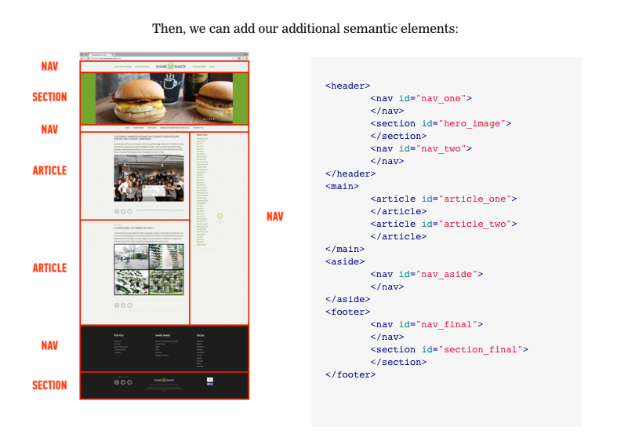

# Semantic Elements

## Semantic Elements

**Semantic elements** group and organize content with descriptive names that clearly imply the purpose of the content around which they are wrapped. Structuring your HTML with semantic elements will improve your page in a number of ways:

1\) **Organization**: If you ever need to update your code, it will be easier to find the specific block that you're looking for.

2\) **Optimization**: Search engines like Google will have an easier time understanding the content on your site, making your site easier for users to find.

3\) **Accessibility**: Screen readers \(devices that read the content on websites for users with vision and reading disabilities\) can more easily navigate your site, making it more accessible for everyone.

### Basic Semantic Elements

The first four semantic elements you should know are `<header>`, `<footer>`, `<main>`, and `<aside>`. These establish the beginning, end, primary, and secondary content of your page.

#### `<header> </header>`

These elements kick off your page with introductory content, such as logos, headlines, titles, and links.

#### `<footer> </footer>`

Footers wrap the content at the bottom of your web page. It often contains copyright information, links to career pages, contact information, terms of use, etc.

#### `<main> </main>`

These elements contain all the primary content on the page — articles, blog posts, images, videos, etc. — and live between the `<header>` and `<footer>`.

#### `<aside> </aside>`

These elements contain all the secondary content, and also live between the `<header>` and `<footer>`. They wrap secondary content and supplemental information, like recommended stories or archived links.

While these elements provide a fundamental structure for your page, they definitely lack specificity. But there are additional elements that can help fix that!

### Additional Semantic Elements

After adding your `<header>`, `<main>`, `<aside>`, and `<footer>` elements, you'll need to nest several additional semantic elements within those to further organize your page.

You may have noticed that certain elements — particularly `<section>`, `<nav>`, and `<article>` — repeated several times throughout the page. That's perfectly fine; however, if that's the case in your code, make sure to add class or ID attributes to each one to ensure it's easy to find and manipulate.

Other than `<main>`, which should only appear once in an HTML page, semantic elements can recur as many times as necessary throughout your page. You'll often find nesting certain semantic elements within other semantic elements can help with organization. For example, a long `<article>` element might be broken down with several `<section>` elements or even its own `<header>` and `<footer>` elements nested inside.

A few other semantic elements you can use are:

#### `<nav> </nav>`

Any navigational links that help users get around your page should be wrapped in `<nav>` tags.

#### `<section> </section>`

These elements are used to group the content of a page into related chunks. Section tags would work okay for this example page; however, there's an even better semantic element available...

#### `<article> </article>`

These elements are used to contain standalone blocks of text, such as news articles, blog posts, etc.

_As you continue to build web pages, you'll find that organizing your code with clear semantic elements will make creating content, developing styles, and fixing bugs much easier._

[On to the next lesson.](div-and-span.md)

